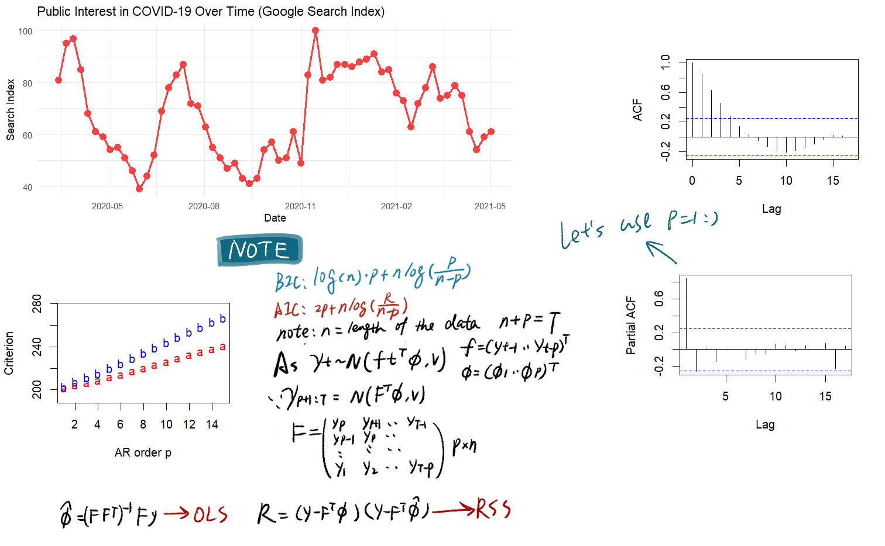
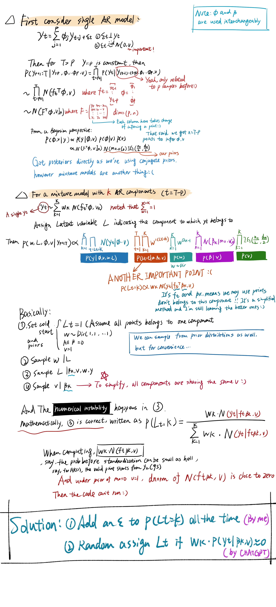
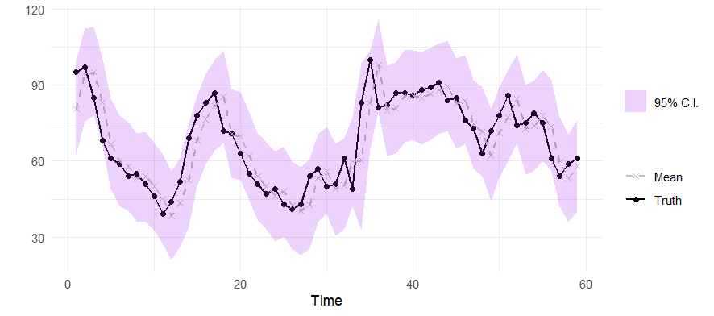

# Diagnosing-Underflow-in-Gibbs-Sampling-for-Mixture-AR-Models-with-Zero-Centered-Priors

**Honestly, Please jump directly to the Modeling part as other parts are boring as hell**

## Executive summary
This project was completed as the final assignment for the _Bayesian Statistics_ specialization offered by the _University of California, Santa Cruz_ on Coursera. During Gibbs sampling for a Bayesian mixture autoregressive (AR) model focusing on time series modeling, I encountered unexpected numerical instability with priors assigned by the course. Specifically, the sampling process broke down when attempting to compute the posterior probability of the latent variable.

This project explains how such instability arises combining the basic of mixture AR models and corresponding Bayesian inference, and highlights approaches for mitigating underflow.

## Data & EDA
The dataset “GoogleSearchIndex.txt” represents weekly search interest regarding COVID-19 from 2020 to 2021, as measured by Google Trends. This search index reflects the relative volume of queries over time, serving as a proxy for public concern or attention to the pandemic.

I will briefly outline the process of selecting the order of the autoregressive (AR) model via AIC and BIC, which both suggest an AR(1) structure. The core focus will be on the next stage—determine the number of mixture components via the Deviance Information Criterion (DIC).

## Modeling
Based on the observed trends in the data distribution, we decided to build a Bayesian mixture model consisting of multiple AR(1) components. This allows us to capture potential regime-switching behavior or latent heterogeneity in the time series. The model is implemented within a Bayesian framework using Gibbs sampling, and the number of mixture components is selected via the Deviance Information Criterion (DIC).

The overall modeling process involves the following steps:

After addressing the numerical instability caused by underflow in the posterior assignment step for latent variables \( L_t \), we proceeded with model selection using the Deviance Information Criterion (DIC). Specifically, we tested autoregressive (AR) orders \( p = 2, 3, 4, 5 \), and selected the final model based on the lowest DIC score.

Get the final model of order = 2 and generate posterior predictive samples:

## Code Usage Instructions

- Determine the AR model order using AIC and BIC

To identify the optimal AR order run:

**Determine the order.R**

This script fits AR models with varying orders and evaluates them using AIC and BIC criteria.

- Select the number of mixture components via DIC
  
To perform Bayesian model selection using the Deviance Information Criterion (DIC), run:

**Determine the number of components via DIC.R**

This script fits mixture AR models for different combinations of p and component count K, and selects the best based on DIC.

- Gibbs Sampling and Posterior Inference

To run the full Bayesian inference and obtain posterior samples of parameters, run:

**Gibbs sampling and posterior inference.R**

This script executes the Gibbs sampler and outputs posterior estimates of all parameters.

